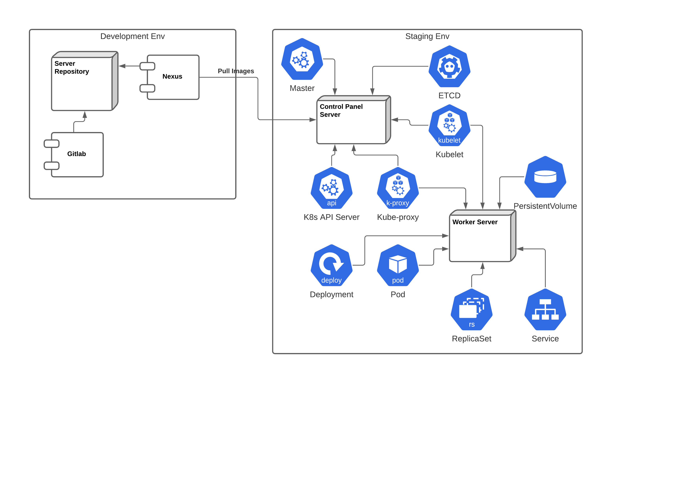
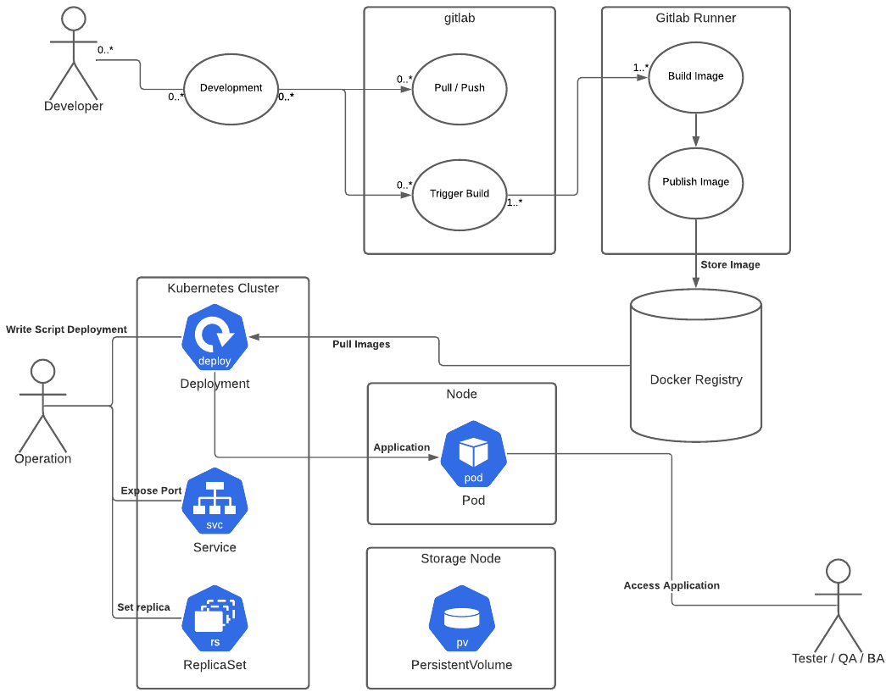

# Gitlab CI/CD deploy to Kubernetes cluster

How to deploy to kubernetes using Gitlab CI/CD from existing kubernetes cluster

ref: 
- https://docs.gitlab.com/ee/user/project/clusters/add_remove_clusters.html
- https://docs.gitlab.com/runner/executors/kubernetes.html
- https://docs.gitlab.com/ee/ci/environments/

## Workflow

Konfigurasi Server & Workflow untuk Automated DevOps menggunakan Gitlab CI/CD & Kubernetes

